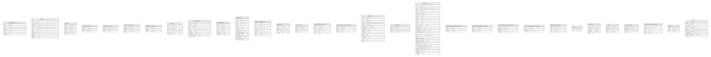

# mackerel

## Tables

| Name | Columns | Comment | Type |
| ---- | ------- | ------- | ---- |
| [alert_history](alert_history.md) | 7 |  | BASE TABLE |
| [alerts](alerts.md) | 11 |  | BASE TABLE |
| [api_keys](api_keys.md) | 6 |  | BASE TABLE |
| [channel_emails](channel_emails.md) | 3 |  | BASE TABLE |
| [channel_events](channel_events.md) | 3 |  | BASE TABLE |
| [channel_mentions](channel_mentions.md) | 4 |  | BASE TABLE |
| [channel_user_ids](channel_user_ids.md) | 3 |  | BASE TABLE |
| [channels](channels.md) | 6 |  | BASE TABLE |
| [check_reports](check_reports.md) | 9 |  | BASE TABLE |
| [dashboards](dashboards.md) | 7 |  | BASE TABLE |
| [downtimes](downtimes.md) | 13 |  | BASE TABLE |
| [graph_annotations](graph_annotations.md) | 8 |  | BASE TABLE |
| [graph_defs](graph_defs.md) | 5 |  | BASE TABLE |
| [host_meta](host_meta.md) | 4 |  | BASE TABLE |
| [host_metric_values](host_metric_values.md) | 5 |  | BASE TABLE |
| [host_metric_values_latest](host_metric_values_latest.md) | 4 |  | BASE TABLE |
| [hosts](hosts.md) | 15 |  | BASE TABLE |
| [invitations](invitations.md) | 4 |  | BASE TABLE |
| [monitors](monitors.md) | 30 |  | BASE TABLE |
| [notification_group_channels](notification_group_channels.md) | 3 |  | BASE TABLE |
| [notification_group_children](notification_group_children.md) | 3 |  | BASE TABLE |
| [notification_group_monitors](notification_group_monitors.md) | 4 |  | BASE TABLE |
| [notification_group_services](notification_group_services.md) | 3 |  | BASE TABLE |
| [notification_groups](notification_groups.md) | 4 |  | BASE TABLE |
| [orgs](orgs.md) | 2 |  | BASE TABLE |
| [role_meta](role_meta.md) | 5 |  | BASE TABLE |
| [roles](roles.md) | 4 |  | BASE TABLE |
| [service_meta](service_meta.md) | 4 |  | BASE TABLE |
| [service_metric_values](service_metric_values.md) | 5 |  | BASE TABLE |
| [services](services.md) | 3 |  | BASE TABLE |
| [users](users.md) | 9 |  | BASE TABLE |

## Relations

---

> Generated by [tbls](https://github.com/k1LoW/tbls)
