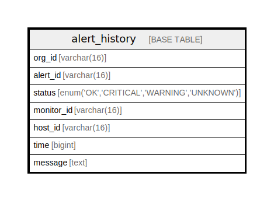

# alert_history

## Description

<details>
<summary><strong>Table Definition</strong></summary>

```sql
CREATE TABLE `alert_history` (
  `org_id` varchar(16) NOT NULL,
  `alert_id` varchar(16) NOT NULL,
  `status` enum('OK','CRITICAL','WARNING','UNKNOWN') NOT NULL,
  `monitor_id` varchar(16) NOT NULL,
  `host_id` varchar(16) DEFAULT NULL,
  `time` bigint NOT NULL,
  `message` text,
  PRIMARY KEY (`alert_id`,`monitor_id`,`time` DESC)
) ENGINE=InnoDB DEFAULT CHARSET=utf8mb4 COLLATE=utf8mb4_0900_ai_ci
```

</details>

## Columns

| Name | Type | Default | Nullable | Children | Parents | Comment |
| ---- | ---- | ------- | -------- | -------- | ------- | ------- |
| org_id | varchar(16) |  | false |  |  |  |
| alert_id | varchar(16) |  | false |  |  |  |
| status | enum('OK','CRITICAL','WARNING','UNKNOWN') |  | false |  |  |  |
| monitor_id | varchar(16) |  | false |  |  |  |
| host_id | varchar(16) |  | true |  |  |  |
| time | bigint |  | false |  |  |  |
| message | text |  | true |  |  |  |

## Constraints

| Name | Type | Definition |
| ---- | ---- | ---------- |
| PRIMARY | PRIMARY KEY | PRIMARY KEY (alert_id, monitor_id, time) |

## Indexes

| Name | Definition |
| ---- | ---------- |
| PRIMARY | PRIMARY KEY (alert_id, monitor_id, time) USING BTREE |

## Relations



---

> Generated by [tbls](https://github.com/k1LoW/tbls)
