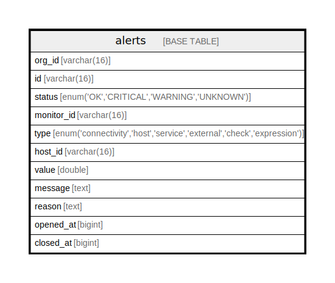

# alerts

## Description

<details>
<summary><strong>Table Definition</strong></summary>

```sql
CREATE TABLE `alerts` (
  `org_id` varchar(16) NOT NULL,
  `id` varchar(16) NOT NULL,
  `status` enum('OK','CRITICAL','WARNING','UNKNOWN') NOT NULL,
  `monitor_id` varchar(16) NOT NULL,
  `type` enum('connectivity','host','service','external','check','expression') NOT NULL,
  `host_id` varchar(16) DEFAULT NULL,
  `value` double DEFAULT NULL,
  `message` text,
  `reason` text,
  `opened_at` bigint DEFAULT NULL,
  `closed_at` bigint DEFAULT NULL,
  PRIMARY KEY (`id`),
  KEY `idx` (`org_id`,`opened_at` DESC)
) ENGINE=InnoDB DEFAULT CHARSET=utf8mb4 COLLATE=utf8mb4_0900_ai_ci
```

</details>

## Columns

| Name | Type | Default | Nullable | Children | Parents | Comment |
| ---- | ---- | ------- | -------- | -------- | ------- | ------- |
| org_id | varchar(16) |  | false |  |  |  |
| id | varchar(16) |  | false |  |  |  |
| status | enum('OK','CRITICAL','WARNING','UNKNOWN') |  | false |  |  |  |
| monitor_id | varchar(16) |  | false |  |  |  |
| type | enum('connectivity','host','service','external','check','expression') |  | false |  |  |  |
| host_id | varchar(16) |  | true |  |  |  |
| value | double |  | true |  |  |  |
| message | text |  | true |  |  |  |
| reason | text |  | true |  |  |  |
| opened_at | bigint |  | true |  |  |  |
| closed_at | bigint |  | true |  |  |  |

## Constraints

| Name | Type | Definition |
| ---- | ---- | ---------- |
| PRIMARY | PRIMARY KEY | PRIMARY KEY (id) |

## Indexes

| Name | Definition |
| ---- | ---------- |
| idx | KEY idx (org_id, opened_at) USING BTREE |
| PRIMARY | PRIMARY KEY (id) USING BTREE |

## Relations



---

> Generated by [tbls](https://github.com/k1LoW/tbls)
