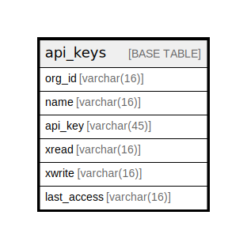

# api_keys

## Description

<details>
<summary><strong>Table Definition</strong></summary>

```sql
CREATE TABLE `api_keys` (
  `org_id` varchar(16) NOT NULL,
  `name` varchar(16) NOT NULL,
  `api_key` varchar(45) NOT NULL,
  `xread` varchar(16) NOT NULL DEFAULT '1',
  `xwrite` varchar(16) NOT NULL DEFAULT '1',
  `last_access` varchar(16) NOT NULL DEFAULT '0',
  PRIMARY KEY (`api_key`)
) ENGINE=InnoDB DEFAULT CHARSET=utf8mb4 COLLATE=utf8mb4_0900_ai_ci
```

</details>

## Columns

| Name | Type | Default | Nullable | Children | Parents | Comment |
| ---- | ---- | ------- | -------- | -------- | ------- | ------- |
| org_id | varchar(16) |  | false |  |  |  |
| name | varchar(16) |  | false |  |  |  |
| api_key | varchar(45) |  | false |  |  |  |
| xread | varchar(16) | 1 | false |  |  |  |
| xwrite | varchar(16) | 1 | false |  |  |  |
| last_access | varchar(16) | 0 | false |  |  |  |

## Constraints

| Name | Type | Definition |
| ---- | ---- | ---------- |
| PRIMARY | PRIMARY KEY | PRIMARY KEY (api_key) |

## Indexes

| Name | Definition |
| ---- | ---------- |
| PRIMARY | PRIMARY KEY (api_key) USING BTREE |

## Relations



---

> Generated by [tbls](https://github.com/k1LoW/tbls)
