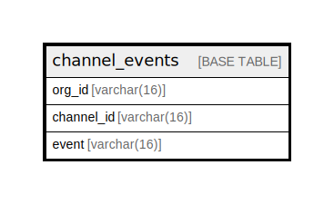

# channel_events

## Description

<details>
<summary><strong>Table Definition</strong></summary>

```sql
CREATE TABLE `channel_events` (
  `org_id` varchar(16) NOT NULL,
  `channel_id` varchar(16) NOT NULL,
  `event` varchar(16) NOT NULL,
  PRIMARY KEY (`channel_id`,`event`)
) ENGINE=InnoDB DEFAULT CHARSET=utf8mb4 COLLATE=utf8mb4_0900_ai_ci
```

</details>

## Columns

| Name | Type | Default | Nullable | Children | Parents | Comment |
| ---- | ---- | ------- | -------- | -------- | ------- | ------- |
| org_id | varchar(16) |  | false |  |  |  |
| channel_id | varchar(16) |  | false |  |  |  |
| event | varchar(16) |  | false |  |  |  |

## Constraints

| Name | Type | Definition |
| ---- | ---- | ---------- |
| PRIMARY | PRIMARY KEY | PRIMARY KEY (channel_id, event) |

## Indexes

| Name | Definition |
| ---- | ---------- |
| PRIMARY | PRIMARY KEY (channel_id, event) USING BTREE |

## Relations



---

> Generated by [tbls](https://github.com/k1LoW/tbls)
