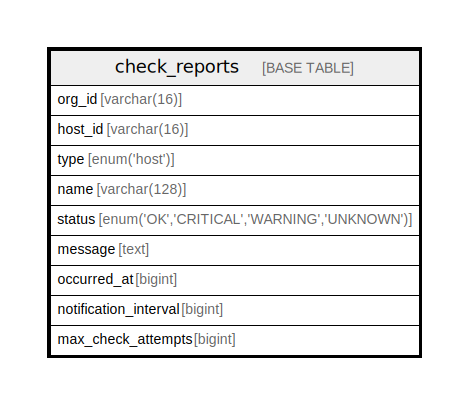

# check_reports

## Description

<details>
<summary><strong>Table Definition</strong></summary>

```sql
CREATE TABLE `check_reports` (
  `org_id` varchar(16) NOT NULL,
  `host_id` varchar(16) NOT NULL,
  `type` enum('host') NOT NULL,
  `name` varchar(128) NOT NULL,
  `status` enum('OK','CRITICAL','WARNING','UNKNOWN') NOT NULL,
  `message` text,
  `occurred_at` bigint DEFAULT NULL,
  `notification_interval` bigint DEFAULT NULL,
  `max_check_attempts` bigint DEFAULT NULL,
  PRIMARY KEY (`host_id`,`name`)
) ENGINE=InnoDB DEFAULT CHARSET=utf8mb4 COLLATE=utf8mb4_0900_ai_ci
```

</details>

## Columns

| Name | Type | Default | Nullable | Children | Parents | Comment |
| ---- | ---- | ------- | -------- | -------- | ------- | ------- |
| org_id | varchar(16) |  | false |  |  |  |
| host_id | varchar(16) |  | false |  |  |  |
| type | enum('host') |  | false |  |  |  |
| name | varchar(128) |  | false |  |  |  |
| status | enum('OK','CRITICAL','WARNING','UNKNOWN') |  | false |  |  |  |
| message | text |  | true |  |  |  |
| occurred_at | bigint |  | true |  |  |  |
| notification_interval | bigint |  | true |  |  |  |
| max_check_attempts | bigint |  | true |  |  |  |

## Constraints

| Name | Type | Definition |
| ---- | ---- | ---------- |
| PRIMARY | PRIMARY KEY | PRIMARY KEY (host_id, name) |

## Indexes

| Name | Definition |
| ---- | ---------- |
| PRIMARY | PRIMARY KEY (host_id, name) USING BTREE |

## Relations



---

> Generated by [tbls](https://github.com/k1LoW/tbls)
