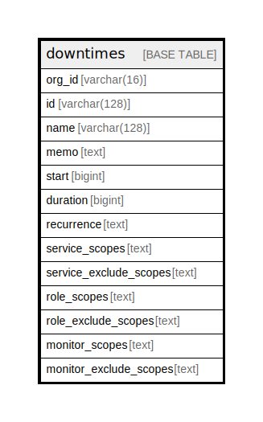

# downtimes

## Description

<details>
<summary><strong>Table Definition</strong></summary>

```sql
CREATE TABLE `downtimes` (
  `org_id` varchar(16) NOT NULL,
  `id` varchar(128) NOT NULL,
  `name` varchar(128) NOT NULL,
  `memo` text,
  `start` bigint DEFAULT NULL,
  `duration` bigint DEFAULT NULL,
  `recurrence` text,
  `service_scopes` text,
  `service_exclude_scopes` text,
  `role_scopes` text,
  `role_exclude_scopes` text,
  `monitor_scopes` text,
  `monitor_exclude_scopes` text,
  PRIMARY KEY (`id`)
) ENGINE=InnoDB DEFAULT CHARSET=utf8mb4 COLLATE=utf8mb4_0900_ai_ci
```

</details>

## Columns

| Name | Type | Default | Nullable | Children | Parents | Comment |
| ---- | ---- | ------- | -------- | -------- | ------- | ------- |
| org_id | varchar(16) |  | false |  |  |  |
| id | varchar(128) |  | false |  |  |  |
| name | varchar(128) |  | false |  |  |  |
| memo | text |  | true |  |  |  |
| start | bigint |  | true |  |  |  |
| duration | bigint |  | true |  |  |  |
| recurrence | text |  | true |  |  |  |
| service_scopes | text |  | true |  |  |  |
| service_exclude_scopes | text |  | true |  |  |  |
| role_scopes | text |  | true |  |  |  |
| role_exclude_scopes | text |  | true |  |  |  |
| monitor_scopes | text |  | true |  |  |  |
| monitor_exclude_scopes | text |  | true |  |  |  |

## Constraints

| Name | Type | Definition |
| ---- | ---- | ---------- |
| PRIMARY | PRIMARY KEY | PRIMARY KEY (id) |

## Indexes

| Name | Definition |
| ---- | ---------- |
| PRIMARY | PRIMARY KEY (id) USING BTREE |

## Relations



---

> Generated by [tbls](https://github.com/k1LoW/tbls)
