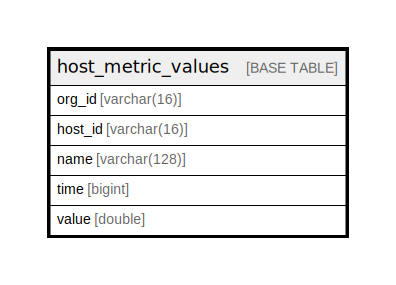

# host_metric_values

## Description

<details>
<summary><strong>Table Definition</strong></summary>

```sql
CREATE TABLE `host_metric_values` (
  `org_id` varchar(16) NOT NULL,
  `host_id` varchar(16) NOT NULL,
  `name` varchar(128) NOT NULL,
  `time` bigint NOT NULL,
  `value` double NOT NULL,
  PRIMARY KEY (`host_id`,`name`,`time` DESC)
) ENGINE=InnoDB DEFAULT CHARSET=utf8mb4 COLLATE=utf8mb4_0900_ai_ci
```

</details>

## Columns

| Name | Type | Default | Nullable | Children | Parents | Comment |
| ---- | ---- | ------- | -------- | -------- | ------- | ------- |
| org_id | varchar(16) |  | false |  |  |  |
| host_id | varchar(16) |  | false |  |  |  |
| name | varchar(128) |  | false |  |  |  |
| time | bigint |  | false |  |  |  |
| value | double |  | false |  |  |  |

## Constraints

| Name | Type | Definition |
| ---- | ---- | ---------- |
| PRIMARY | PRIMARY KEY | PRIMARY KEY (host_id, name, time) |

## Indexes

| Name | Definition |
| ---- | ---------- |
| PRIMARY | PRIMARY KEY (host_id, name, time) USING BTREE |

## Relations



---

> Generated by [tbls](https://github.com/k1LoW/tbls)
