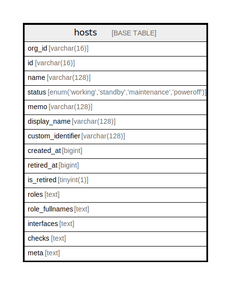

# hosts

## Description

<details>
<summary><strong>Table Definition</strong></summary>

```sql
CREATE TABLE `hosts` (
  `org_id` varchar(16) NOT NULL,
  `id` varchar(16) NOT NULL,
  `name` varchar(128) NOT NULL,
  `status` enum('working','standby','maintenance','poweroff') NOT NULL,
  `memo` varchar(128) NOT NULL DEFAULT '',
  `display_name` varchar(128) DEFAULT NULL,
  `custom_identifier` varchar(128) DEFAULT NULL,
  `created_at` bigint DEFAULT NULL,
  `retired_at` bigint DEFAULT NULL,
  `is_retired` tinyint(1) DEFAULT NULL,
  `roles` text,
  `role_fullnames` text,
  `interfaces` text,
  `checks` text,
  `meta` text,
  PRIMARY KEY (`id`)
) ENGINE=InnoDB DEFAULT CHARSET=utf8mb4 COLLATE=utf8mb4_0900_ai_ci
```

</details>

## Columns

| Name | Type | Default | Nullable | Children | Parents | Comment |
| ---- | ---- | ------- | -------- | -------- | ------- | ------- |
| org_id | varchar(16) |  | false |  |  |  |
| id | varchar(16) |  | false |  |  |  |
| name | varchar(128) |  | false |  |  |  |
| status | enum('working','standby','maintenance','poweroff') |  | false |  |  |  |
| memo | varchar(128) |  | false |  |  |  |
| display_name | varchar(128) |  | true |  |  |  |
| custom_identifier | varchar(128) |  | true |  |  |  |
| created_at | bigint |  | true |  |  |  |
| retired_at | bigint |  | true |  |  |  |
| is_retired | tinyint(1) |  | true |  |  |  |
| roles | text |  | true |  |  |  |
| role_fullnames | text |  | true |  |  |  |
| interfaces | text |  | true |  |  |  |
| checks | text |  | true |  |  |  |
| meta | text |  | true |  |  |  |

## Constraints

| Name | Type | Definition |
| ---- | ---- | ---------- |
| PRIMARY | PRIMARY KEY | PRIMARY KEY (id) |

## Indexes

| Name | Definition |
| ---- | ---------- |
| PRIMARY | PRIMARY KEY (id) USING BTREE |

## Relations



---

> Generated by [tbls](https://github.com/k1LoW/tbls)
