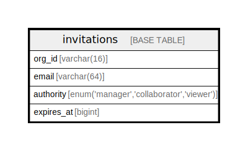

# invitations

## Description

<details>
<summary><strong>Table Definition</strong></summary>

```sql
CREATE TABLE `invitations` (
  `org_id` varchar(16) NOT NULL,
  `email` varchar(64) NOT NULL,
  `authority` enum('manager','collaborator','viewer') NOT NULL,
  `expires_at` bigint DEFAULT NULL,
  PRIMARY KEY (`org_id`,`email`)
) ENGINE=InnoDB DEFAULT CHARSET=utf8mb4 COLLATE=utf8mb4_0900_ai_ci
```

</details>

## Columns

| Name | Type | Default | Nullable | Children | Parents | Comment |
| ---- | ---- | ------- | -------- | -------- | ------- | ------- |
| org_id | varchar(16) |  | false |  |  |  |
| email | varchar(64) |  | false |  |  |  |
| authority | enum('manager','collaborator','viewer') |  | false |  |  |  |
| expires_at | bigint |  | true |  |  |  |

## Constraints

| Name | Type | Definition |
| ---- | ---- | ---------- |
| PRIMARY | PRIMARY KEY | PRIMARY KEY (org_id, email) |

## Indexes

| Name | Definition |
| ---- | ---------- |
| PRIMARY | PRIMARY KEY (org_id, email) USING BTREE |

## Relations



---

> Generated by [tbls](https://github.com/k1LoW/tbls)
