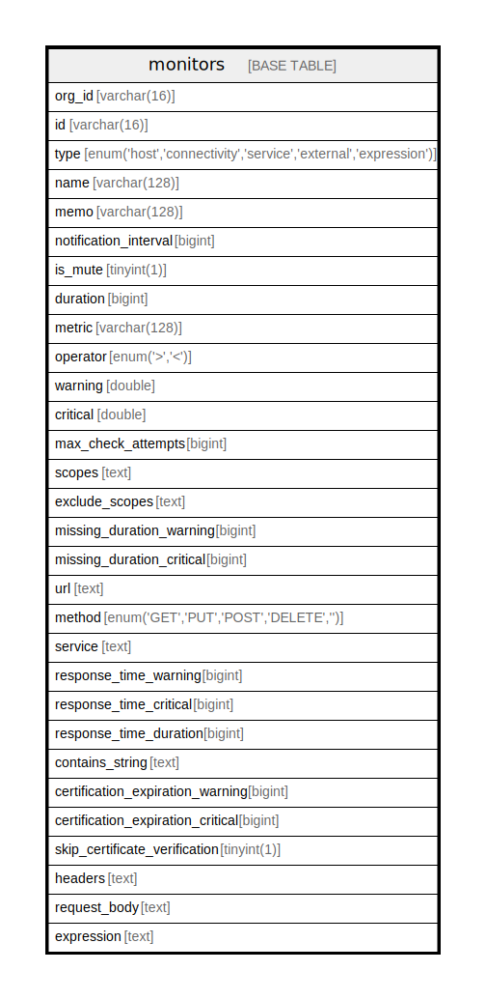

# monitors

## Description

<details>
<summary><strong>Table Definition</strong></summary>

```sql
CREATE TABLE `monitors` (
  `org_id` varchar(16) NOT NULL,
  `id` varchar(16) NOT NULL,
  `type` enum('host','connectivity','service','external','expression') DEFAULT NULL,
  `name` varchar(128) NOT NULL,
  `memo` varchar(128) NOT NULL DEFAULT '',
  `notification_interval` bigint NOT NULL DEFAULT '1',
  `is_mute` tinyint(1) NOT NULL DEFAULT '0',
  `duration` bigint DEFAULT NULL,
  `metric` varchar(128) DEFAULT NULL,
  `operator` enum('>','<') NOT NULL DEFAULT '<',
  `warning` double DEFAULT NULL,
  `critical` double DEFAULT NULL,
  `max_check_attempts` bigint DEFAULT NULL,
  `scopes` text,
  `exclude_scopes` text,
  `missing_duration_warning` bigint DEFAULT NULL,
  `missing_duration_critical` bigint DEFAULT NULL,
  `url` text,
  `method` enum('GET','PUT','POST','DELETE','') DEFAULT NULL,
  `service` text,
  `response_time_warning` bigint DEFAULT NULL,
  `response_time_critical` bigint DEFAULT NULL,
  `response_time_duration` bigint DEFAULT NULL,
  `contains_string` text,
  `certification_expiration_warning` bigint DEFAULT NULL,
  `certification_expiration_critical` bigint DEFAULT NULL,
  `skip_certificate_verification` tinyint(1) DEFAULT NULL,
  `headers` text,
  `request_body` text,
  `expression` text,
  PRIMARY KEY (`id`)
) ENGINE=InnoDB DEFAULT CHARSET=utf8mb4 COLLATE=utf8mb4_0900_ai_ci
```

</details>

## Columns

| Name | Type | Default | Nullable | Children | Parents | Comment |
| ---- | ---- | ------- | -------- | -------- | ------- | ------- |
| org_id | varchar(16) |  | false |  |  |  |
| id | varchar(16) |  | false |  |  |  |
| type | enum('host','connectivity','service','external','expression') |  | true |  |  |  |
| name | varchar(128) |  | false |  |  |  |
| memo | varchar(128) |  | false |  |  |  |
| notification_interval | bigint | 1 | false |  |  |  |
| is_mute | tinyint(1) | 0 | false |  |  |  |
| duration | bigint |  | true |  |  |  |
| metric | varchar(128) |  | true |  |  |  |
| operator | enum('>','<') | < | false |  |  |  |
| warning | double |  | true |  |  |  |
| critical | double |  | true |  |  |  |
| max_check_attempts | bigint |  | true |  |  |  |
| scopes | text |  | true |  |  |  |
| exclude_scopes | text |  | true |  |  |  |
| missing_duration_warning | bigint |  | true |  |  |  |
| missing_duration_critical | bigint |  | true |  |  |  |
| url | text |  | true |  |  |  |
| method | enum('GET','PUT','POST','DELETE','') |  | true |  |  |  |
| service | text |  | true |  |  |  |
| response_time_warning | bigint |  | true |  |  |  |
| response_time_critical | bigint |  | true |  |  |  |
| response_time_duration | bigint |  | true |  |  |  |
| contains_string | text |  | true |  |  |  |
| certification_expiration_warning | bigint |  | true |  |  |  |
| certification_expiration_critical | bigint |  | true |  |  |  |
| skip_certificate_verification | tinyint(1) |  | true |  |  |  |
| headers | text |  | true |  |  |  |
| request_body | text |  | true |  |  |  |
| expression | text |  | true |  |  |  |

## Constraints

| Name | Type | Definition |
| ---- | ---- | ---------- |
| PRIMARY | PRIMARY KEY | PRIMARY KEY (id) |

## Indexes

| Name | Definition |
| ---- | ---------- |
| PRIMARY | PRIMARY KEY (id) USING BTREE |

## Relations



---

> Generated by [tbls](https://github.com/k1LoW/tbls)
