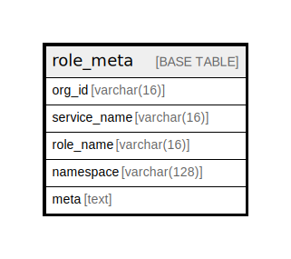

# role_meta

## Description

<details>
<summary><strong>Table Definition</strong></summary>

```sql
CREATE TABLE `role_meta` (
  `org_id` varchar(16) NOT NULL,
  `service_name` varchar(16) NOT NULL,
  `role_name` varchar(16) NOT NULL,
  `namespace` varchar(128) NOT NULL,
  `meta` text,
  PRIMARY KEY (`org_id`,`role_name`,`namespace`)
) ENGINE=InnoDB DEFAULT CHARSET=utf8mb4 COLLATE=utf8mb4_0900_ai_ci
```

</details>

## Columns

| Name | Type | Default | Nullable | Children | Parents | Comment |
| ---- | ---- | ------- | -------- | -------- | ------- | ------- |
| org_id | varchar(16) |  | false |  |  |  |
| service_name | varchar(16) |  | false |  |  |  |
| role_name | varchar(16) |  | false |  |  |  |
| namespace | varchar(128) |  | false |  |  |  |
| meta | text |  | true |  |  |  |

## Constraints

| Name | Type | Definition |
| ---- | ---- | ---------- |
| PRIMARY | PRIMARY KEY | PRIMARY KEY (org_id, role_name, namespace) |

## Indexes

| Name | Definition |
| ---- | ---------- |
| PRIMARY | PRIMARY KEY (org_id, role_name, namespace) USING BTREE |

## Relations



---

> Generated by [tbls](https://github.com/k1LoW/tbls)
