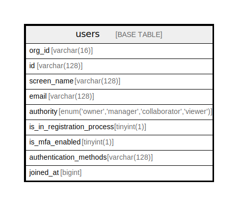

# users

## Description

<details>
<summary><strong>Table Definition</strong></summary>

```sql
CREATE TABLE `users` (
  `org_id` varchar(16) NOT NULL,
  `id` varchar(128) NOT NULL,
  `screen_name` varchar(128) DEFAULT NULL,
  `email` varchar(128) DEFAULT NULL,
  `authority` enum('owner','manager','collaborator','viewer') NOT NULL,
  `is_in_registration_process` tinyint(1) DEFAULT NULL,
  `is_mfa_enabled` tinyint(1) DEFAULT NULL,
  `authentication_methods` varchar(128) NOT NULL,
  `joined_at` bigint DEFAULT NULL,
  PRIMARY KEY (`id`)
) ENGINE=InnoDB DEFAULT CHARSET=utf8mb4 COLLATE=utf8mb4_0900_ai_ci
```

</details>

## Columns

| Name | Type | Default | Nullable | Children | Parents | Comment |
| ---- | ---- | ------- | -------- | -------- | ------- | ------- |
| org_id | varchar(16) |  | false |  |  |  |
| id | varchar(128) |  | false |  |  |  |
| screen_name | varchar(128) |  | true |  |  |  |
| email | varchar(128) |  | true |  |  |  |
| authority | enum('owner','manager','collaborator','viewer') |  | false |  |  |  |
| is_in_registration_process | tinyint(1) |  | true |  |  |  |
| is_mfa_enabled | tinyint(1) |  | true |  |  |  |
| authentication_methods | varchar(128) |  | false |  |  |  |
| joined_at | bigint |  | true |  |  |  |

## Constraints

| Name | Type | Definition |
| ---- | ---- | ---------- |
| PRIMARY | PRIMARY KEY | PRIMARY KEY (id) |

## Indexes

| Name | Definition |
| ---- | ---------- |
| PRIMARY | PRIMARY KEY (id) USING BTREE |

## Relations



---

> Generated by [tbls](https://github.com/k1LoW/tbls)
